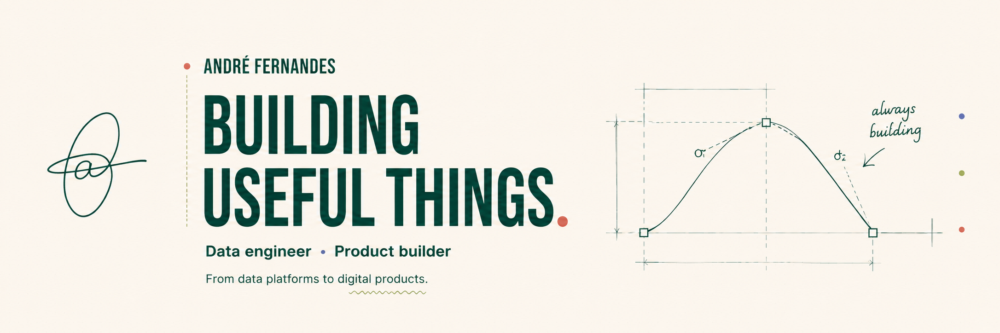

  

  <strong>Data engineer · Product builder</strong>

  I build useful things — from data platforms to digital products.

  
  

---

## 01 — About

I'm André — a **data engineer and product builder from Portugal**.

Professionally, I work on the systems that make data useful: reliable pipelines, distributed processing, orchestration, data platforms, data quality and the engineering foundations behind analytics.

Outside of that, I build products.

My background also includes **Machine Learning and Computer Vision**, developed through academic research and my master's thesis at Bosch Security Systems.

Different problems, same principle:

**Build useful things.**

---

## 02 — What I work with

### Data Engineering

### Data Platforms

### Product Engineering

### Engineering

---

## 03 — Currently building

### ORDO

**Less chaos. More clarity.**

A personal organization product designed to bring **tasks, calendar events, habits, journaling and routines** into one clear experience.

`Next.js` · `React` · `Node.js` · `PostgreSQL`

---

### Service Business Platform

A customizable booking and operations platform for service businesses, designed around the idea that the software should feel like part of the business — not like a third-party tool.

The platform combines **booking, customer management, operations, automated communications and analytics** into one configurable system.

`Next.js` · `TypeScript` · `Fastify` · `PostgreSQL`

---

## 04 — Selected work

### Data Engineering · Deloitte

I currently work as a **Tech Consultant in AI & Data / Data Engineering**, building and operating data solutions for high-volume environments.

Some of the areas I work across:

- Spark and PySpark pipelines processing multi-million-row workloads
- Batch orchestration and operational dependencies with Apache Airflow
- Data movement between Oracle Data Warehouse environments and Apache Iceberg-based Data Lakes
- Incremental processing and partition-aware loading
- Data quality, validation and reconciliation
- Distributed workload troubleshooting and performance improvement
- SQL-based access and processing through Trino

I joined Deloitte as a Tech Analyst in July 2025 and was promoted to **Tech Consultant in July 2026**.

---

### Computer Vision · Bosch Security Systems

For my master's thesis, I researched methods for identifying **blemishes and anomalies in industrial image sensors**.

The work explored approaches including:

- Feature engineering
- Isolation Forest
- One-Class SVM
- GAN-based methods
- Industrial image-quality analysis

The project resulted in a successful proof of concept, with the resulting research **published and presented at IEEE MECO 2025**.

---

## 05 — Selected public project

### [Advanced Traffic Analysis from Fixed-Camera Video](https://github.com/vBarFace/ADVANCED-TRAFFIC-ANALYSIS-FROM-FIXED-CAMERA-VIDEO-DATA)

A computer-vision project developed during my bachelor's degree to extract traffic information from fixed-camera video.

The project combines image processing and computer vision techniques to transform raw video into useful traffic metrics.

---

## 06 — Background

### University of Aveiro

**M.Sc. in Computational Engineering**  
2022–2025

**B.Sc. in Computational Engineering**  
2019–2022

### Machine Learning Specialization

**DeepLearning.AI / Stanford University**

- Supervised Machine Learning: Regression and Classification
- Advanced Learning Algorithms
- Unsupervised Learning, Recommenders and Reinforcement Learning

[View credential profile →](https://www.coursera.org/user/fb5210b9b4949a09c98ddb03be592915)

---

## 07 — Elsewhere

There's more to me than code and pipelines.

I write about my work, projects and the things I'm building — alongside the rest of life — at:

### [andre-fernandes.com →](https://andre-fernandes.com)

You can also find me on [LinkedIn](https://www.linkedin.com/in/andre-fernandes-868006207/).

---

  <strong>Building useful things.</strong>

  <a href="https://andre-fernandes.com">andre-fernandes.com</a>

